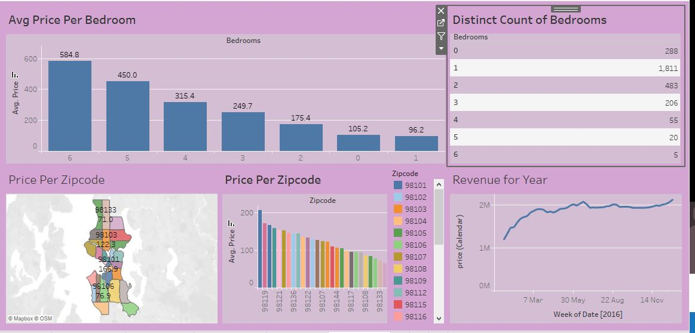

# AirBnB-Analysis-Tableau-Project
The goal of this project is to explore the relationship between key variables and Airbnb prices and visualize this information in an accessible and interactive manner.

## Project Overview
This project utilizes data analysis and visualization to explore AirBnB pricing patterns, revenue trends, and the influence of variables like bedroom count and zip codes on pricing. The primary tool used for visualizations is Tableau, the dataset includes information from various AirBnB listings.

This project investigates the pricing trends of AirBnB properties based on various factors such as bedroom count and zip code. It also includes an analysis of the revenue generated over the course of a year.

### Key Insights:
- **Avg Price Per Bedroom**: Shows how the average price of AirBnB listings varies with the number of bedrooms.
- **Price Per Zipcode**: Displays how AirBnB pricing fluctuates across different zip codes.
- **Revenue for Year**: Illustrates the revenue growth over time for AirBnB properties.
- **Distinct Count of Bedrooms**: Analyzes how the number of bedrooms correlates with property counts.

# AirBnB Analysis Dashboard

## Technologies Used

- **Tableau**: For building and visualizing the dashboard.
- **Excel**: For preprocessing, cleaning and analyzing the data before importing it to Tableau.

